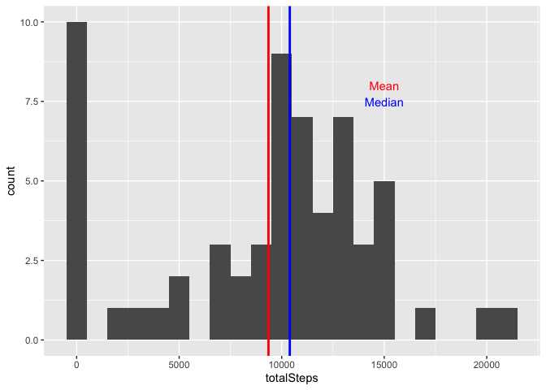

## Loading and preprocessing the data


```r
library(dplyr)
library(ggplot2)
unzip("activity.zip")
activityData = read.csv("activity.csv")
```

## What is mean total number of steps taken per day?

```r
dailySteps = group_by(activityData, date = as.Date(date)) %>% 
    summarise(totalSteps = sum(steps, na.rm = TRUE), .groups="drop")
plot = ggplot(dailySteps, aes(totalSteps)) + geom_histogram(binwidth = 1000)
plot(plot)
```

<!-- -->

## What is the average daily activity pattern?

```r
mean = mean(dailySteps$totalSteps)

plot = plot + geom_vline(xintercept = mean, col="red", lwd=1) +
    annotate(geom="text", x=15000, y=8, label="Mean", col="red")
plot(plot)
```

<!-- -->

## Imputing missing values


## Are there differences in activity patterns between weekdays and weekends?
